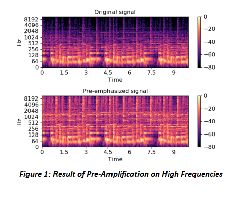
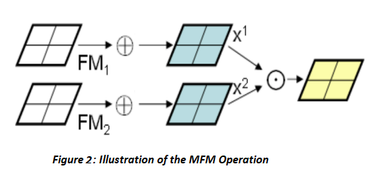
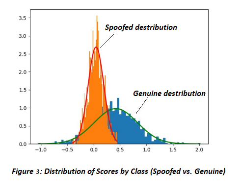

# Speech Spoofing Detection

This project, conducted in 2019, investigates detecting replayed (spoofed) speech via a Light CNN (LCNN) initially designed for noisy image recognition. The objective is to classify `.wav` audio files (drawn from the ASVspoof2017 dataset) as either genuine or replayed by extracting Mel-Frequency Cepstral Coefficients (MFCCs), applying pre-emphasis, and then zero-padding to ensure consistent input shapes.

  

LCNN leverages Maximum Feature Map (MFM) after each convolution, reducing the parameter count by filtering out weaker activations.

  

                                                  
Early experiments with a deeper LCNN configuration suffered significant overlap in genuine vs. spoof probability distributions, but reducing the model’s depth or filter count substantially improved class separation.

Training involved cross-entropy loss and Stochastic Gradient Descent with a dynamic learning rate, and performance was assessed by visualizing score distributions for each class.

  

                                                  

